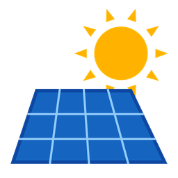

# SmartSolar for Home Assistant

[](https://github.com/hassanxs/smartsolar-ha/actions/workflows/validate.yml)
[](https://hacs.xyz/docs/faq/custom_repositories)



A Home Assistant integration for [SmartSolar](https://smartsolar.net.pk), the WiFi
connectivity dongle sold in Pakistan that brings pure sine wave solar inverters online. It uses
the [SmartSolar cloud API](https://www.smartsolar.net.pk/api/doc.html) to read live status,
energy usage and faults, and to change inverter settings.

This is an unofficial community integration and is not affiliated with SmartSolar.

## Features

- **Live status** (every 30 s by default): PV, grid, load, battery and inverter readings, plus the inverter mode, charge mode, temperatures and errors.
- **Energy** (every 5 min): today's and this month's kWh totals for solar, battery and grid. These sensors work in the **Energy dashboard**. The same report also gives peak power, efficiency, savings (PKR) and trees planted.
- **Faults** (every 30 min): the number of faults this month, with the fault list as attributes.
- **Controls** (every 15 min): each inverter setting becomes a select entity, e.g. Output Source Priority (Utility, Solar or SBU), Charger Source Priority, Buzzer and Battery Cut-off Volt. You can turn these off in the integration options.

## Rate limit — read this

SmartSolar allows **30 requests per minute per device**. Going over disables API access for
1 hour, and **three violations disable it permanently**. This integration:

- uses about 2.5 requests per minute with the default settings,
- enforces a local hard cap of 20 requests per minute,
- stops all requests for 1 hour if the server ever reports a rate limit.

The minimum status interval is 15 s. Do not run other scripts or tools against the same API
key while the integration is running.

## Installation

### HACS (recommended)
[](https://my.home-assistant.io/redirect/hacs_repository/?owner=hassanxs&repository=smartsolar-ha&category=integration)

1. In HACS, open ⋮ → **Custom repositories**.
2. Add `https://github.com/hassanxs/smartsolar-ha` and choose type **Integration**.
3. Search for **SmartSolar**, download it, then restart Home Assistant.

### Manual
Copy `custom_components/smartsolar` into your Home Assistant `config/custom_components/`
folder, then restart Home Assistant.

## Setup
1. In the SmartSolar app or portal, open **iSetting**, enable **API Access** and copy the key.
2. In Home Assistant, go to **Settings → Devices & services → Add integration → SmartSolar**, then paste the key.
3. Optional: open **Configure** to change the polling interval, hide grid alerts or turn off controls.

### Energy dashboard
- Solar production: **Solar energy today**
- Grid consumption: **Grid to load energy today**. Add **Grid to battery energy today** too if you charge from the grid.
- Battery: **Solar to battery energy today** (energy in) and **Battery to load energy today** (energy out)

## Development

`scripts/check_api.py` checks an API key outside Home Assistant and shows how each value is parsed:

```bash
SMARTSOLAR_API_KEY=<key> python scripts/check_api.py        # 1 request
SMARTSOLAR_API_KEY=<key> python scripts/check_api.py --all  # 5 requests
```

Tests run on Linux or WSL (Home Assistant does not run on Windows):

```bash
pip install -r requirements_test.txt
pytest
```

`scripts/make_brand.py` regenerates the icon and logo.

## License

MIT
